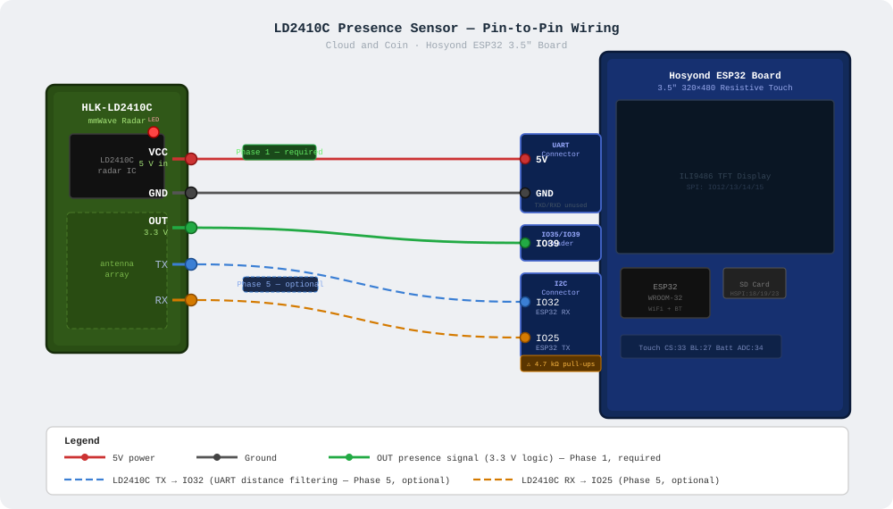

# LD2410C Presence Sensor — Implementation Notes

> Generated by Claude AI

This document covers the implementation of the Hi-Link HLK-LD2410C mmWave presence sensor with display auto-dim and ESP32 light sleep. It is a companion to `CC_ld2410c_presence_sleep_plan.md`, which contains the original design rationale and hardware research.

---

## Hardware Wiring

### Wiring Diagram



```
  HLK-LD2410C                              Hosyond ESP32 Board
  ┌──────────────┐                         ┌───────────────────────────────┐
  │              │                         │                               │
  │  VCC  (5V)  ├─────────────────────────┤ 5V  ┐                        │
  │              │                         │     ├─ UART Connector         │
  │  GND        ├─────────────────────────┤ GND ┘                        │
  │              │                         │                               │
  │  OUT  (3.3V)├─────────────────────────┤ IO39 ── IO35/IO39 Header     │
  │              │                         │                               │
  │  TX   (3.3V)├╌╌╌╌╌╌╌╌╌╌╌╌╌╌╌╌╌╌╌╌╌╌╌╌┤ IO32 ┐                       │
  │              │   Phase 5 / optional    │      ├─ I2C Connector ⚠      │
  │  RX   (3.3V)├╌╌╌╌╌╌╌╌╌╌╌╌╌╌╌╌╌╌╌╌╌╌╌╌┤ IO25 ┘                       │
  │              │                         │                               │
  └──────────────┘                         └───────────────────────────────┘

  ───  required wiring (Phase 1)
  ╌╌╌  optional UART wiring (Phase 5, not yet implemented)
  ⚠    IO32/IO25 have 4.7 kΩ pull-ups to 3.3V on this connector —
       see I2C pull-up caution below
```

### Pin Reference Table

| LD2410C Pin | Logic | ESP32 Pin | Board Connector | Notes |
|---|---|---|---|---|
| VCC | 5V pwr | 5V | UART connector | Sensor stays powered during ESP32 light sleep |
| GND | — | GND | UART connector | Use UART connector — IO39 has no adjacent power pins |
| OUT | 3.3V | IO39 | IO35/IO39 header | Input-only GPIO, currently unused in firmware |
| TX | 3.3V | IO32 | I2C connector | Phase 5 only — ESP32 RX |
| RX | 3.3V | IO25 | I2C connector | Phase 5 only — ESP32 TX |

**Why the UART connector for power:** Its TXD/RXD pins are unused by the sensor in Phase 1. The SPI connector's 5V/GND pins are occupied by the SD card cable. IO39 has no adjacent 5V/GND pins, so the UART connector is the cleanest single-cable power source.

**IO39** is preferred for OUT because it is input-only (no accidental drive risk) and unallocated. Do not use IO35 — reserved as battery charging-status input per `CC_charging_monitor_wiring_notes.md`.

**I2C pull-up caution (Phase 5):** IO32 and IO25 are on the board's I2C connector, which typically has 4.7 kΩ pull-up resistors to 3.3V. The LD2410C defaults to 256000 baud where stray pull-ups can degrade signal quality. If UART communication is unreliable, inspect or remove those pull-ups before assuming the sensor or firmware is at fault.

---

## Compile-Time Defines

Defined in `src/main.cpp` near the battery monitor block:

```cpp
#ifndef ENABLE_PRESENCE_SLEEP
#define ENABLE_PRESENCE_SLEEP       1   // set to 0 to disable entirely
#endif
#define PRESENCE_OUT_PIN            39
#define PRESENCE_SLEEP_AFTER_SEC    60  // seconds idle before sleep
#define PRESENCE_POLL_SEC            5  // light-sleep wake interval
```

Set `ENABLE_PRESENCE_SLEEP 0` (or pass `-D ENABLE_PRESENCE_SLEEP=0` in `platformio.ini`) to compile the feature out with zero runtime cost.

---

## SD Card Config Keys

Add any of these to `/secrets.txt` on the SD card to override compile-time defaults at runtime:

| Key | Default | Valid Range | Description |
|---|---|---|---|
| `presence_enabled` | `1` | `0` or `1` | Enable/disable at runtime without reflashing |
| `presence_sleep_after_seconds` | `60` | `10–3600` | Idle time before display sleeps |
| `presence_poll_seconds` | `5` | `2–60` | How often the ESP32 wakes to check the OUT pin |
| `presence_max_distance_cm` | `250` | `50–800` | Reserved for future UART distance filtering |

Example `/secrets.txt` additions:

```
presence_enabled=1
presence_sleep_after_seconds=60
presence_poll_seconds=5
presence_max_distance_cm=250
```

---

## State Machine

The feature runs a four-state machine driven by `updatePresenceSensor()` in `loop()`.

```
                presence detected
       ┌─────────────────────────────────────────┐
       │                                         │
  ┌────▼─────┐   idle ≥ 50% timeout   ┌──────────┴──┐
  │  ACTIVE  ├──────────────────────► │   DIMMED    │
  └──────────┘                        └──────┬───────┘
       ▲                                     │ idle ≥ 100% timeout
       │                                     ▼
  ┌────┴─────┐   presence detected    ┌──────────────┐
  │  WAKING  │◄───────────────────────┤   SLEEPING   │
  └──────────┘                        └──────────────┘
                                      (light sleep loop,
                                       wakes every poll_sec)
```

| State | Backlight | Data Refreshes | ESP32 |
|---|---|---|---|
| ACTIVE | Full brightness (from config) | Normal | Running |
| DIMMED | ~20% | Normal | Running |
| SLEEPING | Off (0%) | Paused (loop blocked in sleep) | Light sleep |
| WAKING | Restored | Resumes | Running |

**DIMMED** is entered at `sleep_after_seconds / 2` idle time as a soft warning before full sleep.

**SLEEPING** calls `esp_light_sleep_start()` with a timer wakeup of `poll_seconds`. The ESP32 resumes from that call after each timer fire and immediately re-reads IO39. WiFi and RAM are preserved across light sleep (unlike deep sleep).

### Touch resets the idle timer

Touch activity must also reset the idle timer, otherwise the display can dim or sleep while the user is actively interacting with it.

The existing variable `lastTouchInteractionMs` (set in `main.cpp` whenever a tap is processed) already tracks the last touch event. Rather than modifying the touch handler, `updatePresenceSensor()` factors it into the idle calculation directly:

```cpp
// Both sensor presence and touch activity count as "someone is here"
unsigned long lastActivityMs = max(presenceLastSeenMs, lastTouchInteractionMs);
unsigned long idleMs = now - lastActivityMs;
```

`presenceLastSeenMs` continues to be updated only by the OUT pin so that the two signals stay independent. The combined `lastActivityMs` is what drives the ACTIVE → DIMMED → SLEEPING transitions.

---

## New / Modified Files

| File | Change |
|---|---|
| `src/main.cpp` | Compile-time defines; `DeviceConfig` fields; `#include` of presence_sensor.inc; `initPresenceSensor()` in `setup()`; `updatePresenceSensor()` in `loop()` |
| `src/app/helpers.inc` | `DeviceConfig` struct fields; `resetDeviceConfigDefaults()`; `applyDeviceConfigValue()`; `buildSecretsFileFromConfig()` |
| `src/app/presence_sensor.inc` | **New.** Full state machine, GPIO read, backlight helpers, light sleep |

---

## Serial Output

Expected messages during normal operation:

| Event | Serial message |
|---|---|
| Boot (feature enabled) | `Presence: enabled pin=39 sleep_after=60s poll=5s` |
| Display dimming | *(silent — just backlight change)* |
| Entering sleep | `Presence: sleeping` |
| Waking to presence | `Presence: active` |

---

## Test Checklist

- [ ] `pio run` compiles without errors or warnings
- [ ] Serial shows `Presence: enabled pin=39 ...` at boot
- [ ] Cover sensor — display dims after ~30 s, backlight off after ~60 s
- [ ] Uncover sensor — backlight restores within `presence_poll_seconds`
- [ ] Touch the screen while idle — confirms display stays on and idle timer resets
- [ ] Touch the screen while dimmed — confirms backlight returns to full brightness
- [ ] Add `presence_sleep_after_seconds=15` to `/secrets.txt`; reboot; confirm 15 s timeout
- [ ] Set `presence_enabled=0` in `/secrets.txt`; reboot; confirm no dim/sleep occurs
- [ ] Touch navigates pages normally after wake
- [ ] Crypto and weather data refreshes resume after wake
- [ ] Web routes (`/`, `/info`, `/config`) respond after sleep/wake cycles
- [ ] SD card remains stable (no re-init errors) across repeated sleep cycles
- [ ] No serial monitor instability during light sleep
- [ ] `ENABLE_PRESENCE_SLEEP 0` build compiles and runs with no presence behavior
